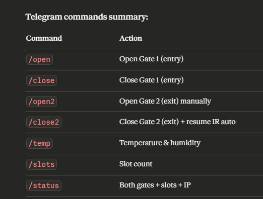

# IoT-Group1-Mini-Project

## Introduction
The Smart Parking System is an Internet of Things (IoT) solution designed to improve parking management by automatically detecting vehicle presence and controlling parking gates. The system uses an ESP32 microcontroller connected to multiple sensors and actuators to monitor parking availability and manage entry and exit gates.

The system provides real-time parking information through multiple interfaces, including a web dashboard, a mobile application using Blynk IoT Platform, and a notification system through Telegram. By integrating sensors, automation and cloud communication, the system improves parking efficiency and reduces the time drivers spend searching for available parking spaces. 

FULL DEMONSTRATION VIDEO: [FULL DEMO](https://youtu.be/sLV1_WT_iFk?feature=shared)

## Hardware Description

The hardware components used in this project include sensors for detecting vehicles, displays for showing parking information and actuators for controlling gates.
* **Main Controller:** ESP32 Microcontroller - Handles all sensors inputs, gate control, WiFi communication and system logic
* **Sensors:**
  * DHT11 Temperature and Humidity Sensor - Measures temperatrue and humidity for environmental monitoring
  * HC-SR04 Ultrasonic Distance Sensor - Detects vehicles approaching the entrance gate
  * IR Sensors: detect vehicle presence in parking slots - used for slot availability detection     and exit detection
* **Actuators:**
  * Servo Motors: control entry and exit gates.
* **Displays:** 
  * TM1637 4-Digit Display Module - Displays the number of available parking spaces
  * I2C 16x2 LCD Display - Displays
* **Supporting components:**
  * Power Supply / USB Cable: provides power to the ESP32 and the connected modules
  * Jumper wires: used to connect sensors, displays and actuators to the ESP32 pins 

## System Architecture

The Smart Parking System is designed using an IoT-based architecture where sensors collect real-time data, the microcontroller processes the information, and multiple platforms allow monitoring and control.

The system consists of four main layers: sensing layer, processing layer, communication layer, and application layer.

**1. Sensing Layer**
> The sensing layer consists of multiple sensors responsible for collecting environmental and operational data from the parking area. These sensors continuously provide input to the ESP32 microcontroller.
* **Ultrasonic Sensor:** Vehicle Detection
> The ultrasonic sensor is installed at the parking entrance to detect incoming vehicles. The sensor measures the distance between itself and an object by sending ultrasonic sound waves and measuring the echo time. Inside the system, it performs the following tasks:
  1. Detects when a vehicle approaches the parking entrance
  2. Triggers the gate opening process if parking slots are available
  3. Prevents unnecessary gate opening when no vehicle is present
  > Operational Logic:
  1. The sensor continuously measures distance.
  2. If the detected distance is less than 10 cm, a vehicle is considered present.
  3. The system then checks parking slot availability.
  4. If a slot is available, the gate opens automatically.
  5. This allows the parking system to operate without manual intervention.

* **IR Sensor:** Parking Slot Detection
> Three IR sensors are installed at each parking slot to detect whether a vehicle is occupying the slot. Function in the System:
  1. Monitor individual parking spaces
  2. Determine the number of available parking slots
  3. Update the parking slot display
  4. Provide real-time information to the web dashboard and Blynk application
  > Operational Logic:
  1. Sensor Value is 0 > Slot is empty
  2. Sensor Value is 1 > Slot is Occupied
> Special IR or IR Exit Sensor is an additional infrared sensor which installed at the exit gate to detect vehicles leaving the parking area. **Functions**: Detect vehicles exiting the parking lot and trigger automatic opening of the exit gate. Once a vehicle passes the exit sensor, the system opens the exit gate and automatically closes it after a short delay. 

* **DHT11 Sensor:** Environmental Monitoring
> The DHT11 sensor measures temperature and humidity in the parking environment. Although it is not required for parking operations, it provides useful environmental data for monitoring the parking area. The data is used for:
  1. Displaying environmental conditions on the LCD screen
  2. Sending temperature and humidity data to the Blynk application
  3. Providing environmental monitoring through Telegram commands

**2. Processing Layer**

> The processing layer is the core intelligence of the system, handled by the ESP32 microcontroller running MicroPython.The ESP32 is responsible for:

- Reading sensor data
- Counting available parking slots
- Controlling the entry and exit gates
- Preventing vehicles from entering when parking is full
- Sending system data to IoT platforms

> Parking Slot Management: The ESP32 reads the IR slot sensors and determines the number of available parking spaces.
>  Gate Control Logic: The ESP32 determines when to open or close the parking gates based on several conditions. The entry gate opens when a vehicle is detected by the ultrasonic sensor and at least one parking slot is available. The entry gate remains closed when no vehicle is detected and parking is full. Lastly, the exit gate opens automatically when the exit IR sensor detects a vehicle leaving.

* **Actuators: Servo Motors**

Two servo motors are used to control the parking gates.
 
1. Entry Gate Servo:
- Opens when a vehicle is detected and parking is available
- Closes automatically after the vehicle enters

2. Exit Gate Servo:
- Opens when a vehicle passes the exit sensor
- Closes after a short delay

**Display**

***1. LCD 16x2 Display***
The LCD screen displays system status locally. Displayed information includes:
- Available parking slots
- Gate status
- Temperature
- Humidity

***2. TM1637 7-Segment Display***
The TM1637 display shows the number of available parking slots at the parking entrance. Drivers can easily see whether parking is available before entering the parking area.

**3. Communication Layer**
> The communication layer allows the system to exchange data with external devices and cloud services. This layer uses the ESP32’s built-in WiFi module to connect to the internet and transfer data. This communication layer ensures that the system can be monitored and controlled remotely via IoT platforms.

- **Internet / WiFi Connectivity:**
The ESP32 connects to a wireless network and communicates with external platforms using internet protocols. Data transmitted through this layer includes: Parking slot availability, gate status, temperature and humidity. Functions of this layer include:

1. Sending parking data to IoT platforms (Telegram bot, website, and Blynk mobile app)
2. Receiving remote commands
3. Hosting the web dashboard
4. Sending notifications

**4. Application Layer**
> he application layer contains the user interfaces and applications used to monitor and control the system. These applications allow users to interact with the parking system remotely. The system integrates **three main IoT platforms**.

**Telegram Bot**
> The Telegram bot provides a messaging interface that allows users to interact with the system using commands.

**Web Dashboard**
> The ESP32 hosts a built-in web server that provides a real-time dashboard accessible through a web browser. Users can open the dashboard using the ESP32 IP address. Features:
- Real-time parking slot display
- Slot occupancy visualization
- Gate status monitoring
- Temperature and humidity display
- Manual gate control buttons

**Blynk Mobile Application**
> The Blynk app provides a mobile dashboard that allows users to monitor the parking system in real time. Features:
- Display available parking slots
- Show temperature and humidity data
- Display gate status
- Allow remote gate control

## Software Architecture 

The software architecture of the Smart Parking System follows a continuous control loop. After system initialization, the ESP32 connects to WiFi and IoT platforms. The system continuously reads sensor data, calculates parking slot availability, and determines whether the gate should open or remain closed. The software also updates local displays and sends real-time data to cloud platforms such as Blynk IoT Platform and the web dashboard. In addition, the system listens for user commands from Telegram to provide parking status and environmental information.

## IoT integration 

The system integrates multiple IoT platforms to enable remote monitoring and interaction.
IoT platforms include:
### 1. Blynk App
The ESP32 sends parking and environmental data to Blynk via its API.
Users can:
* View available parking slots
* Monitor temperature and humidity
* Check system status

### 2. Web Dashboard
The ESP32 provides a web interface accessible via browser.
Features include:
* Real-time slot availability
* Gate status
* Environmental data

### 3. Telegram Bot
The Telegram bot allows command-based interaction

### Communication Flow
ESP32 sends data using:
* Blynk API
* HTTP requests (web dashboard)
* Telegram Bot API
Users access the system through mobile app, browser, or messaging

## Working Process Explanation 
The system operates continuously through the following steps:
1. The ESP32 initializes and connects to WiFi
2. Sensors detect vehicle presence and parking occupancy
3. The system calculates available parking slots
4. If a vehicle arrives:
   * Gate opens if slots are available
   * Gate remains closed if parking is full
5. Exit sensor detects leaving vehicles and opens exit gate
6. Displays update parking information
7. Data is sent to IoT platforms
8. Users can monitor the system remotely
This process repeats in real time to ensure accurate and automated parking control.

## Smart Feature

One of the smart features of this system is automatic gate control based on parking slot availability. The system continuously monitors the parking slots using sensors. If all slots are occupied, the entrance gate will remain closed even when a vehicle approaches, preventing additional vehicles from entering the parking area. 

## Challenges Faced
During the development of the Smart Parking System, several challenges were encountered while integrating the hardware and software components.
* Brownout errors: These occurred when multiple components, especially the servo motors, consumed high current simultaneously, causing the microcontroller to reset.
* Unstable TM1637 connections: The TM1637 display occasionally experienced unstable connections due to loose pins, which caused the display to flicker or stop updating.
* Messy wiring: With multiple sensors and modules connected to the microcontroller, managing the wiring became challenging. Careful organization was required to prevent connection errors.
* LCD display issues: The LCD initially did not display any output, which required hardware adjustment using the onboard potentiometer (screw adjustment) to correctly set the screen contrast.
* Servo angle calibration: Determining the correct angle for the servo motors to properly open and close the gates required several tests and adjustments.
* System integration complexity: Integrating multiple systems including sensor code, Telegram communication, the Blynk IoT Platform, and the web dashboard into a single program caused delays and required extensive debugging.
* IR Sensor Testing: While testing the demo, the IR sensors must indicate the absence of sunlight, as they detect infrared light. In sunlight, the sensors activate both lights, so we have to find a location without sunlight to ensure the IR sensors operate accurately.

## Future Improvements
* Increasing parking capacity: The system can be expanded to support more parking slots by adding additional sensors and extending the detection logic.
* Camera-based vehicle detection: Integrating computer vision technology could allow the system to recognize vehicles and read license plates for more advanced parking management.
* More powerful microcontroller: Using a stronger microcontroller with higher processing power and better power management could improve system stability and performance.
* Smart lighting system: Installing lights around the parking area could improve energy efficiency. The lights would automatically turn off when no vehicles are present and turn on when a vehicle enters the parking lot.
